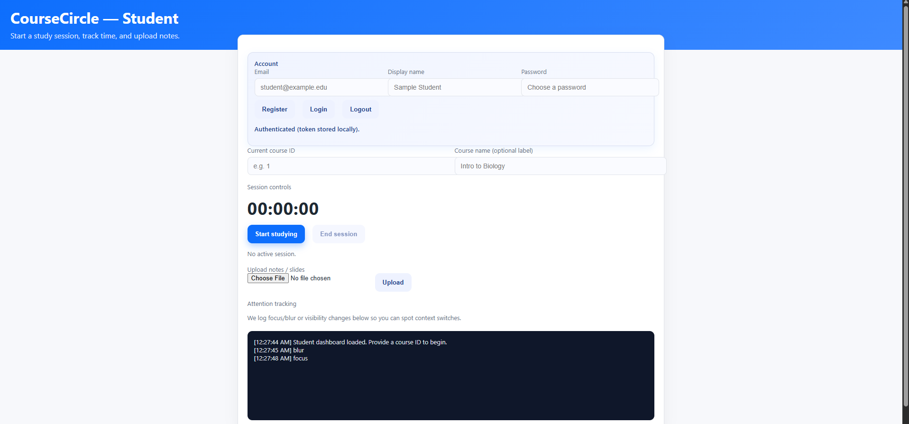

# CourseCircle

Spring Boot backend (Java 17) with minimal static UIs for study sessions, course file uploads, and basic course/user management.



## Features
- JWT auth: register/login at `/api/auth/**`; student page supports inline register/login and stores the token locally.
- Health check: `GET /api/health`
- Sessions: start (`POST /api/sessions`), end (`PATCH /api/sessions/{id}/end`), list (`GET /api/sessions`)
- Courses: list/create (`GET|POST /api/courses`)
- Users: list/create (`GET|POST /api/users`)
- Course files: upload/list/download under `/api/courses/{courseId}/files`
- Static UIs: student dashboard at `/`, dev console at `/dev.html`

## Prereqs
- JDK 17
- Maven
- PostgreSQL running locally (default `jdbc:postgresql://localhost:5432/coursecircle`, user/pass `postgres` unless changed in `application.yml`)

## Run
```
mvn spring-boot:run
```
Then open:
- Student page `/`: register/login, start/end sessions, upload files. Timer pauses on tab blur/hidden.
- Dev page `/dev.html`: health, list/create users, list/create courses, start/end sessions, list sessions, upload/list/download files.

## Notes
- `.env` is ignored; configure secrets locally. Rotate any credentials that were previously committed.
- `ddl-auto: update` is on for now; consider Flyway/Liquibase for migrations.
- Auth is JWT-based; secure and rotate secrets for production.

## Roadmap
- Add more integration/service tests (CI runs against Postgres with the `ci` profile).
- Harden file uploads (hashing, deduplication, limits, better error handling).
- Future: leaderboard for study time and course contributions.
